<div align="center">
  
  
  <h1>🏆 Personal GitHub Trophy Generator</h1>
  <p><b>Automatically generate a neon-style animated GitHub Trophy using GitHub Actions.</b></p>

  <p>
    <a href="https://github.com/ayushraistudio/ayush-trophy/issues">
      
    </a>
    <a href="https://github.com/ayushraistudio/ayush-trophy/network/members">
      
    </a>
    <a href="https://github.com/ayushraistudio/ayush-trophy/stargazers">
      
    </a>
  </p>
</div>

---


## ✨ Features
- 🔄 **Daily Auto Update** via GitHub Actions  
- 🎨 **Neon / Glassmorphism Trophy Design**  
- 📊 **Dynamic Stats** (Active Days, Contributions, Streak 🔥)  
- 🧠 **Uses GitHub's Built-in Token** (No secrets needed)

---

## 🚀 Add This Trophy to Your Profile

### Step 1: Fork the Repository
Fork this repo into your GitHub account.

### Step 2: Enable GitHub Actions
1. Open your fork → **Actions**
2. Enable workflows
3. Select **Update Trophy**
4. Click **Run workflow**

### Step 3: Embed in Your Profile README
Replace `YOUR_USERNAME` and paste this:

```html
<div align="center">
  <a href="https://github.com/ayushraistudio/ayush-trophy">
    
  </a>
</div>
---

## 🎨 Customization
You can customize:
- 🎨 Colors → `src/generateTrophy.js`
- 📐 Size → change `width` in README
- 🧱 Layout / stats → `src/generateTrophy.js`

---

## 🛠️ Run Locally (For Developers)

```bash
git clone https://github.com/YOUR_USERNAME/ayush-trophy.git
cd ayush-trophy
npm install
node index.js
```

This will generate `trophy.svg` locally.

---

## ❗ Troubleshooting
- Trophy not updating? → Re-run the workflow manually  
- SVG not loading? → Wait 1–2 minutes (GitHub raw cache delay)  
- Daily update stopped? → GitHub may auto-disable Actions on forks  

---

<p align="center">
  ⭐ Created by <a href="https://github.com/ayushraistudio">Ayush Rai</a> — Star the repo if you like it ⭐
</p>


